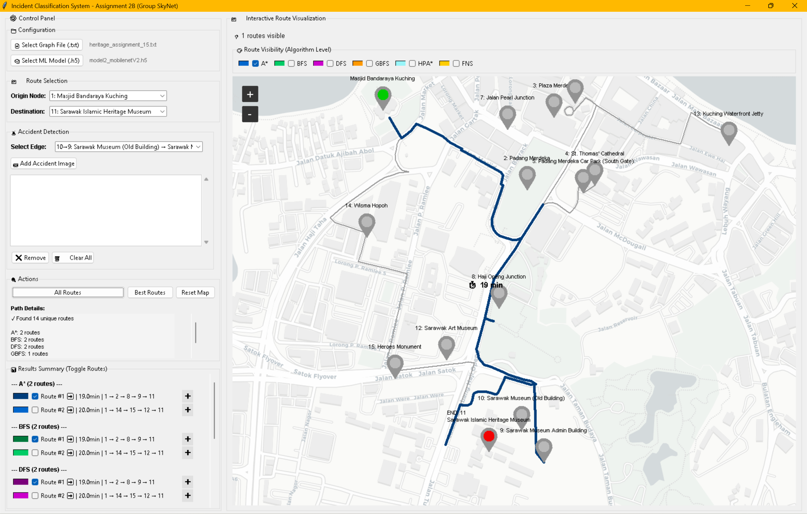
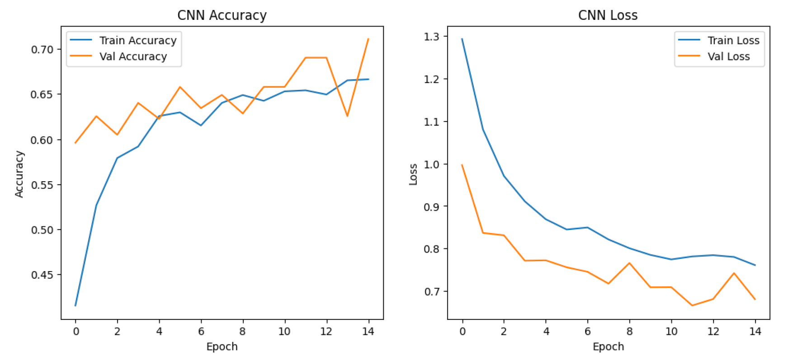
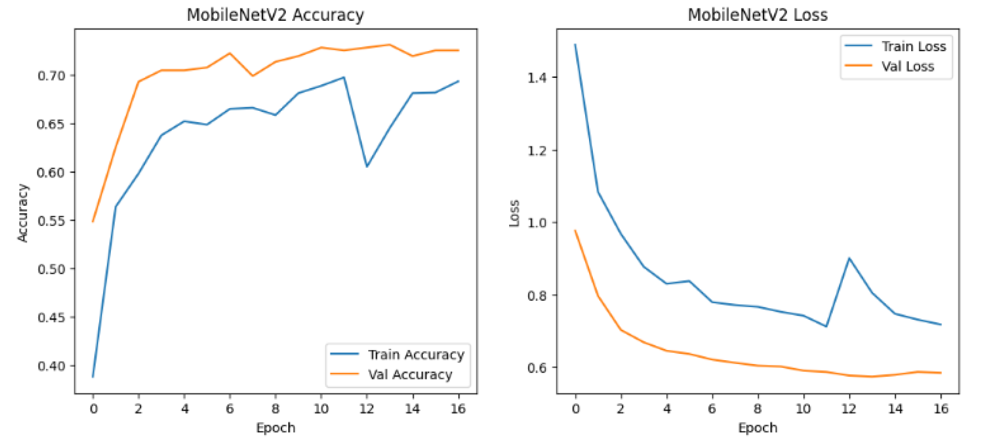
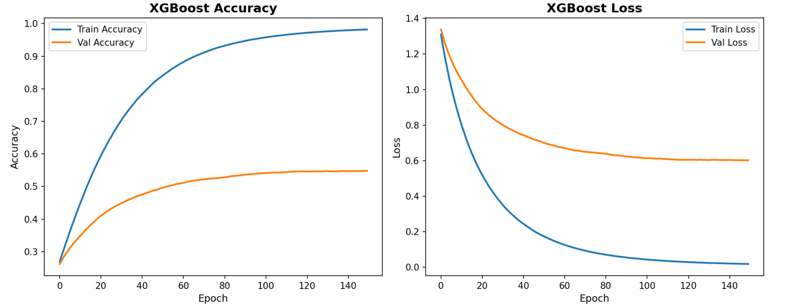
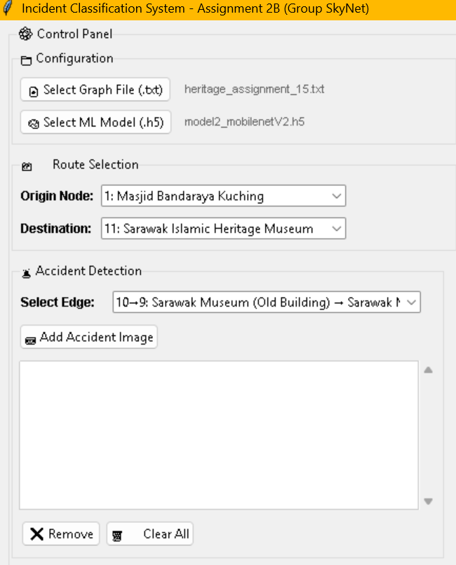
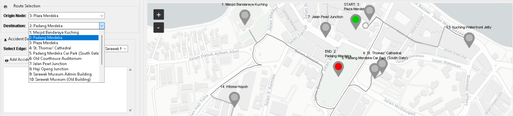
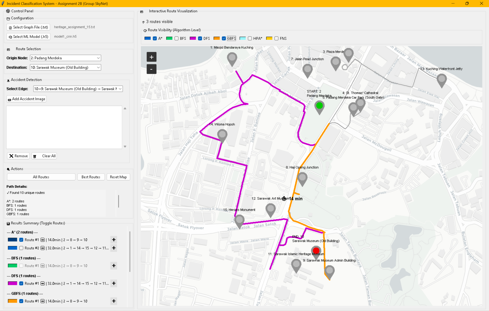
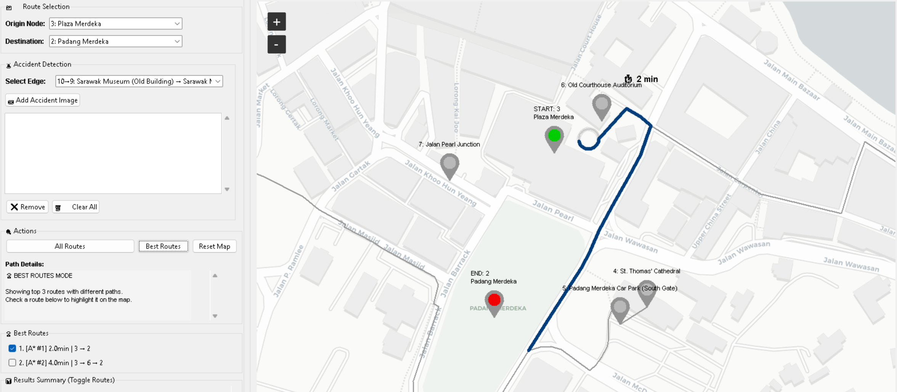
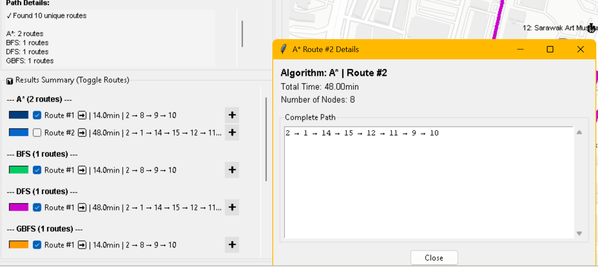

# 🚦 Incident Classification System (ICS)
### COS30019 – Introduction to AI | Assignment 2B | Group SkyNet

An intelligent **Traffic Incident Classification System** that combines machine learning image classification with pathfinding algorithms to dynamically reroute traffic around accidents in the Kuching, Sarawak road network.

---

## Table of Contents
- [Overview](#overview)
- [Features](#features)
- [System Architecture](#system-architecture)
- [ML Models](#ml-models)
- [Pathfinding Algorithms](#pathfinding-algorithms)
- [Installation](#installation)
- [How to Use](#how-to-use)
- [Test Cases](#test-cases)
- [Demo](#demo)

---

## Overview

ICS integrates:
- **3 ML models** (CNN, MobileNetV2, XGBoost) for accident severity classification from images
- **6 pathfinding algorithms** (A\*, BFS, DFS, GBFS, HPA\*, FNS) for route optimisation
- **OpenStreetMap** integration for real Kuching road network visualisation
- An interactive **Tkinter GUI** with live map rendering

When an accident is detected on an edge, the system penalises that road segment and recalculates all routes in real time.



---

## Features

| Feature | Status |
|---|---|
| ML accident severity prediction (None / Minor / Moderate / Severe) | ✅ |
| 3 trained ML models with model auto-detection | ✅ |
| 6 pathfinding algorithms with K=5 alternative routes each | ✅ |
| Interactive map with OpenStreetMap tiles | ✅ |
| Edge-based accident detection with red highlight overlay | ✅ |
| Per-route visibility toggle checkboxes | ✅ |
| Best Routes mode (top 3 unique paths) | ✅ |
| Route travel time marker on map | ✅ |
| Image thumbnail preview in accident list | ✅ |
| Switchable graph files and ML models at runtime | ✅ |
| 10 test cases covering different Kuching districts | ✅ |

---

## System Architecture

```
AI_Assignment_2B/
├── gui_2b.py                    # Main GUI entry point
├── map.osm                      # OpenStreetMap data for Kuching
├── requirements.txt             # Python dependencies
├── integration/
│   ├── ics_system.py            # Core ICS logic & K-route finder
│   ├── accident_predictor.py    # ML model loader & predictor
│   └── osm_helper.py            # OpenStreetMap parsing & routing
├── algorithms/
│   ├── astar.py                 # A* Search
│   ├── bfs.py                   # Breadth-First Search
│   ├── dfs.py                   # Depth-First Search
│   ├── gbfs.py                  # Greedy Best-First Search
│   ├── hpa.py                   # Hierarchical Pathfinding A*
│   └── fns.py                   # Frontier Novelty Search
├── models/                      # ⚠️ Not included — see Installation
│   ├── model1_cnn.h5
│   ├── model2_mobilenetV2.h5
│   └── model3_xgboost.h5
├── testcases/
│   ├── heritage_assignment_15.txt
│   ├── testcase1.txt  →  testcase10.txt
│   └── ...
├── test_images/                 # Sample accident images for testing
└── images/                      # README screenshots & GIFs
```

---

## ML Models

Three models were trained on Google Colab using a dataset sourced from Kaggle and Roboflow. Images were preprocessed with augmentation (rotation, flipping, zoom, brightness, contrast) and pixel values normalised to the 0–1 range. The models classify accident severity into 4 classes:

| Class | Severity | Travel Time Multiplier |
|---|---|---|
| 0 | None | ×1 (no change) |
| 1 | Minor | ×3 |
| 2 | Moderate | ×6 |
| 3 | Severe | ×9 |

### Model Comparison

| Model | Architecture | Accuracy | Macro-F1 | Notes |
|---|---|---|---|---|
| CNN | Custom 3-layer CNN (32/64/128 filters) | 71% | 0.67 | Trained from scratch; struggles with minor/moderate distinction on small datasets |
| MobileNetV2 | Transfer learning (ImageNet backbone, fine-tuned last 120 layers) | 76.8% | 0.74 | Better generalisation across visually similar classes |
| XGBoost | Gradient boosting + frozen MobileNetV2 feature extractor (1280-dim) | 78.2% | 0.75 | Best overall; only 2.6 MB, ~150ms inference; handles class imbalance well |

> The system **auto-detects** the model type at load time — Keras models load directly, XGBoost models are detected via HDF5 key inspection and automatically use a MobileNetV2 feature extractor.





---

## Pathfinding Algorithms

| Algorithm | Type | Uses Heuristic | Notes |
|---|---|---|---|
| A\* | Informed | ✅ Euclidean | Optimal, balances cost & heuristic |
| BFS | Uninformed | ❌ | Finds shortest hop count |
| DFS | Uninformed | ❌ | Fast but not optimal |
| GBFS | Informed | ✅ Euclidean | Greedy, fast but not optimal |
| HPA\* | Hierarchical | ✅ | Cluster-based abstraction with entrance selection |
| FNS | Novelty-based | ❌ | Prioritises nodes with most unexplored neighbours |

Each algorithm finds **up to 5 alternative routes** using an edge-penalisation strategy — once a path is found, its edges are penalised heavily to force the next search to find a different route.

---

## Installation

### Prerequisites

Install all required packages individually:

```bash
pip install tensorflow
pip install xgboost
pip install h5py
pip install numpy
pip install pillow
pip install tkintermapview
```

Or use the requirements file:

```bash
pip install -r requirements.txt
```

> ⚠️ If you have both `python` and `python3`, ensure packages are installed for the correct interpreter.

### Models

The trained model files (`.h5`) are not included in this repository due to GitHub's file size limit. Place your model files in the `models/` folder before running:

- `models/model1_cnn.h5`
- `models/model2_mobilenetV2.h5`
- `models/model3_xgboost.h5`

### Running the System

```bash
python gui_2b.py
```

---

## How to Use

### 1. Load Configuration

On startup, the system loads the default graph (`heritage_assignment_15.txt`) and ML model (`model2_mobilenetV2.h5`). You can switch these at runtime using the buttons in the **Configuration** panel.



### 2. Select Origin & Destination

Use the **Route Selection** dropdowns to pick an origin and destination node from the loaded graph. The map shows the start node with a **green marker** and the end node with a **red marker**.



### 3. Add an Accident

1. Select an **edge** (road segment) from the Accident Detection dropdown
2. Click **📷 Add Accident Image**
3. Browse to an accident photo — the ML model classifies its severity instantly
4. A popup shows the detected severity and confidence
5. The accident edge is highlighted **red** on the map and travel times are recalculated


### 4. Find Routes

- Click **All Routes** to run all 6 algorithms and display up to 5 routes each
- Use the **algorithm-level checkboxes** (top of map panel) to show/hide entire algorithms
- Use the **per-route checkboxes** (Results Summary panel) to toggle individual routes
- A 🔄 symbol next to a route means its path changed after an accident was detected



### 5. Best Routes Mode

Click **Best Routes** to highlight the top 3 cheapest routes (by travel time) with distinct paths. The selected route is shown in full colour with its travel time displayed on the map; unselected routes appear in gray.



### 6. Route Details

Click the **➕** button next to any route in the Results Summary to open a popup with the full node path and travel time.



### 7. Reset

Click **Reset Map** to clear all routes and return to the base map view.

---

## Test Cases

Ten test cases cover different districts and network topologies across Kuching. Each is structured to fit within the OSM map data bounds:

| Test Case | Area | Nodes | Start → Goal(s) | Key Feature |
|---|---|---|---|---|
| `heritage_assignment_15.txt` | Kuching Heritage Zone (Masjid, Padang, Museum area) | 15 | 1 → 10, 13 | Main assignment graph, mixed one-way roads, asymmetric travel times |
| `testcase1.txt` | Chinatown / Waterfront (DBKU Tower to Waterfront Clock Tower) | 10 | 1 → 5, 10 | One-way streets, multiple goals, directional compliance testing |
| `testcase2.txt` | Commercial Hub (Central Mall, Business Tower, Trade Center) | 7 | 5 → 2, 7 | Bidirectional dense network, multi-goal, alternative route exploration |
| `testcase3.txt` | Tabuan Jaya / Stutong area (Mall, Market, Mosque) | 7 | 7 → 5 | Loop-based suburban network, cross-connections, multiple alternative paths |
| `testcase4.txt` | Residential Zone (Garden Villas, Park Residences, Hillside) | 6 | 1 → 4, 5 | Mixed one-way and bidirectional edges, travel-time variation between goals |
| `testcase5.txt` | Samarahan / UiTM area (Gate, Medical Centre, Civic Centre) | 9 | 6 → 3, 4, 9 | Three potential goals, campus service roads, goal prioritisation after accidents |
| `testcase6.txt` | Kuching Heritage (Masjid, Padang, Courthouse, Museum) | 8 | 1 → 10 | Highly connected alternative network, multiple bypass routes |
| `testcase7.txt` | City Centre mesh (City Hall, Mall, Hospital, University) | 5 | 1 → 5 | Fully meshed network, maximum alternative routes, K-route stress test |
| `testcase8.txt` | Medical District (General Hospital, Clinic, Pharmacy Hub) | 6 | 6 → 2, 4 | Tightly interconnected roads, multiple cycles, route diversity testing |
| `testcase9.txt` | Matang Wildlife Centre (Gate to Picnic Clearing) | 5 | 1 → 5 | Linear trail network, strict one-way sections, very limited alternatives |
| `testcase10.txt` | Industrial Area (Factory, Warehouse, Logistics Centre) | 8 | 8 → 3, 4 | Highest accident multiplier (×3), one-way industrial flows, routing stress test |


---

## Demo

### Accident Detection & Route Recalculation


### Best Routes Mode


---

## Group

**Group SkyNet** — COS30019 Introduction to AI, Semester 2 2025

| Name | Student ID |
|---|---|
| Ramisa Nawar | 104388441 |
| Lexi Yung Jun Voo | 104403218 |
| Jonathan Zheng Li Chai | 104400675 |
| Edwin Kong Zheng Quan | 102780074 |

---

## Acknowledgements

- [OpenStreetMap](https://www.openstreetmap.org/) — Road network data for Kuching
- [TkinterMapView](https://github.com/TomSchimansky/TkinterMapView) — Interactive map widget
- [TensorFlow / Keras](https://www.tensorflow.org/) — Deep learning framework
- [XGBoost](https://xgboost.readthedocs.io/) — Gradient boosting library
- [CartoDB](https://carto.com/basemaps/) — Light map tiles
- [Kaggle](https://www.kaggle.com/datasets/prajwalbhamere/car-damage-severity-dataset) — Car damage severity dataset
- [Roboflow](https://universe.roboflow.com/accident-and-nonaccident/accident-and-nonaccident-label-image) — Accident/non-accident image dataset
- Google Gemini — Assisted with model training and evaluation in Google Colab
- Claude AI — Assisted with ICS integration (GUI) and test case development